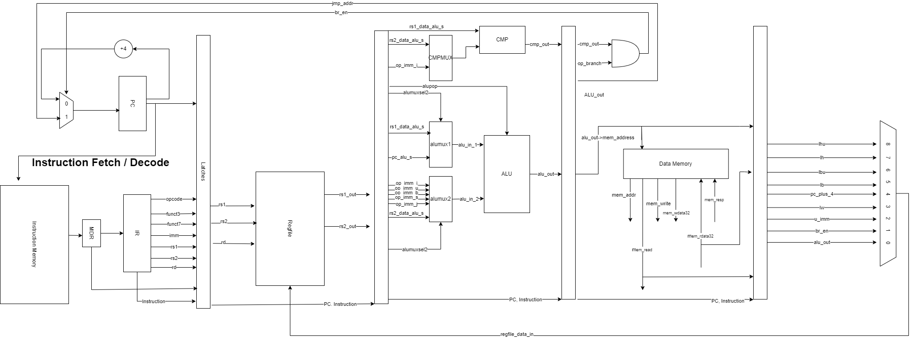

.. .. raw:: html
.. 
..     

.. role:: red
.. role:: redst

-------------------------------------------------
A Pipelined Implementation of the RV32I Processor
-------------------------------------------------

    The software programs described in this document are confidential and proprietary products of
    Synopsys Corp. or its licensors. The terms and conditions
    governing the sale and licensing of Synopsys products are set forth in written
    agreements between Synopsys Corp. and its customers. No representation or other
    affirmation of fact contained in this publication shall be deemed to be a warranty or give rise
    to any liability of Synopsys Corp. whatsoever. Images of software programs in use
    are assumed to be copyright and may not be reproduced.

    This document is for informational and instructional purposes only. The ECE 411 teaching staff
    reserves the right to make changes in specifications and other information contained in this
    publication without prior notice, and the reader should, in all cases, consult the teaching
    staff to determine whether any changes have been made.

.. contents:: Table of Contents
.. section-numbering::

-----

Introduction
============

This machine problem involves the design of a pipelined microprocessor. You are required to
implement the RV32I instruction set (with the exception of ``FENCE*``, ``ECALL``, ``EBREAK``, and
``CSRR`` instructions) using the pipelining techniques described in lectures. This handout is an
incomplete specification to get you started with your design, a portion of this machine problem is
left open ended for you to explore design options that interest you.

You will begin your design by creating a basic pipeline that can execute the RV32I instruction
set. Then, you will add support for hazard detection and data forwarding, as well as integrating
a basic cache system to your pipeline. After implementing a functional pipeline
that can execute the RV32I ISA, you will have the opportunity to expand your design with
advanced design options of your choosing. For groups that correctly implement a functional pipeline,
a competition will be held to find which design can execute our benchmark program in the least
amount of simulation time and consuming the least amount of energy.

The Pipeline
============

Pipeline designed by us:

Pipeline Control
----------------

In this pipelined design, you will be using a simple control memory to generate control signals. No
state diagrams will be allowed for basic pipeline control (state diagrams *are* still allowed for cache
controllers and other parts of your design). The control memory behaves similar to a ROM (read only
memory). When an instruction is ready to be decoded, the opcode (and possibly some other fields of
the instruction word) are sent to a logic block, which then outputs a ``control word`` containing
the signals necessary to control all the pipeline stages of the particular instruction. This control
word is then passed down the pipeline along with other operands needed for the instruction. To
assist in debugging, please pass the *entire* control word as well as the instruction's opcode and
PC down the pipeline. This allows the logic in each stage to be set correctly for that specific
instruction.

One way to implement the control memory discussed above is using a SystemVerilog case statement. You
can implement the control word as a ``struct`` containing the signals that you need. The following
code blocks contain examples for the control word struct and control ROM.

.. _Listing 1:

Listing 1: Example control word definition (define in ``rv32i_types.sv``)

.. code:: verilog

  typedef struct packed {
      rv32i_opcode opcode;
      alu_ops aluop;
      logic regfilemux_sel;
      logic load_regfile;
      /* ... other signals ... */
  } rv32i_control_word;

.. _Listing 2:

Listing 2: Example control memory module

.. code:: verilog

  import rv32i_types::*;

  module control_rom
  (
      input rv32i_opcode opcode,
      /* ... other inputs ... */
      output rv32i_control_word ctrl
  );

  always_comb
  begin
      /* Default assignments */
      ctrl.opcode = opcode;
      ctrl.load_regfile = 1'b0;
      /* ... other defaults ... */

      /* Assign control signals based on opcode */
      case(opcode)
          op_auipc: begin
              ctrl.aluop = alu_add;
          end

          /* ... other opcodes ... */

          default: begin
              ctrl = 0;   /* Unknown opcode, set control word to zero */
          end
      endcase
  end
  endmodule : control_rom

You should only use the ``opcode``, ``funct3``, and ``funct7`` fields from the instruction as the
inputs to this ROM. Also, you must not do any sort of computation in this ROM. The ROM is meant
exclusively for generating simple control signals such as mux selects. Do not use the control
ROM to perform computations (such as addition and branch condition comparisons).

Pipeline Datapath
-----------------

Regardless of your design, you will have to do things in a considerably different manner compared to
your previous MP datapath designs. When you start entering your design into the software tools,
start from scratch. Do not try to copy over your old core datapath design and then edit it.

Between each pipeline stage, you will need a set of registers to hold the values from the previous
stage. Unlike the design shown in the textbook, you do not need to implement those registers as one
colossal box. You are permitted to break the pipeline registers into many smaller registers
each containing one value (e.g., the ALU output, or a control word). Some example implementations
include:

- Modular stages with registered outputs. Break the pipeline into individual modules, each with an
  ``always_ff`` block to create flip-flops on the output signals. This option is the most
  "plug-and-play", allowing a stage's definition to be entirely self-contained.
- Modular stages and modular register "blocks". Each pipeline register is a module consisting of
  individual flip-flops for the relevant signals.
- Monolithic registers with packed structs. Define a struct for each stage's output and instantiate
  registers for these structs between the stages. This has the advantages of automatically scoping
  variable names (``ex.opcode`` vs ``mem.opcode``), allowing easy modification of the interface,
  and is more succinct.

There are no requirements on how you choose to implement your stages. Pick a style that works best for your
group.

Checkpoint 1: RV32I ISA and basic pipelining
~~~~~~~~~~~~~~~~~~~~~~~~~~~~~~~~~~~~~~~~~~~~

By checkpoint 1, you should have a basic pipeline that can handle all of the RV32I instructions (with the
exception of ``FENCE*``, ``ECALL``, ``EBREAK``, and ``CSRR`` instructions). You *do not*
need to handle any control hazards or data hazards. The test code will contain NOPs to allow the
processor to work without hazard detection. For this checkpoint you can use a dual-port "magic"
memory that always sets ``mem_resp`` high immediately, so that you do not have to handle cache misses
or memory stalls.

By the end of this checkpoint, you must provide your mentor TA with paper designs for data forwarding and hazard detection,
as well as a design for your arbiter to interface your instruction and data cache with main memory.

**Please note that your PC should start at 0x80000000 instead of 0x00000060 through out this MP.**

Checkpoint 2: L1 caches + hazards and static branch prediction
~~~~~~~~~~~~~~~~~~~~~~~~~~~~~~~~~~~~~~~~~~~~~~~~~~~~~~~~~~~~~~

By checkpoint 2, your pipeline should be able to do hazard detection and forwarding, including
static-not-taken branch prediction for all control hazards. Note that you should not stall or forward for
dependencies on register ``x0`` or when an instruction does not use one of the source registers (such as
``rs2`` for immediate instructions).

You must also have an arbiter implemented and integrated, such that both split caches (I-Cache and D-Cache) 
connect to the arbiter, which interfaces with memory. Since main memory only has a single port, your arbiter 
determines the priority on which cache request will be served first in the case when both caches miss and 
need to access memory on the same cycle. From this CP, make sure your ``mp4/bin/memory_from_elf.sh`` has 
``ADDRESSABILITY=32``

For groups who do not have a fully functional cache available, we will be providing a small cache for the
purposes of this checkpoint. We encourage groups to use their own designs if available, on this checkpoint
or when moving forward to your advanced design features.

You also need to have RVFI working at this checkpoint.

At this point, you must provide your mentor TA with proposals for advanced features. These may be as detailed 
as you deem necessary -- anything from a written description to a hardware paper design. Your TA may have 
feedback on implementation details or potential challenges, so the more detail you provide now, the more 
helpful your TA can be.

Checkpoint 3: advanced design options
~~~~~~~~~~~~~~~~~~~~~~~~~~~~~~~~~~~~~

Checkpoint 3 is where your team can really differentiate your design. A list of advanced features
which you can choose to implement is provided in the `Advanced Design Options`_ section below, along
with their point values. This is **NOT an exhaustive list**; feel free to propose to your TA any feature
which you think may improve performance, who will add it to the list and assign it a point value.
The features in the provided list are designed to improve performance on most test codes based on
real-world designs.

In order to design, implement, and test them, you need to do background research and consult
your mentor TA. In order to decide on exact feature specifications and tune design parameters (e.g., 
branch history table size, and the size of victim cache), you need information about the performance of
your processor on different codes. This information is provided through **performance counters**.
You should at least have counters for hits and misses in each of your caches, for
mispredictions and total branches in the branch predictor, and for stalls in the pipeline (one for
each class of pipeline stages that get stalled together). Once you have added a few counters, adding
more will be easy, so you should add counters for any part of your design that you want to measure
and use this information to make the design better. The counters may exist as physical registers in
your design or as signal monitors in your testbench. You will not recieve any advanced feature points
without corresponding performance counters.

Note: While the features in CP3 are important for your final design, correctness is infinitely more
important than performance. In general, you should not move on to CP3 until your code works
completely on all of the provided test codes. See the `Grading`_ section for further details on
grading and consult your mentor TA if you become concerned about your progress.

Design Guidelines
=================

Basic Design
------------

Every group must complete the basic pipelined RV32I design which consists of the following:

- **Datapath**

  - 5-stage pipeline which implements the full RV32I ISA (less excluded instructions) [8]
  - Hazard detection and data forwarding (MEM → EX, WB → EX, WB → MEM, transparent register file,
    memory stalling) [8]
  - Static branch prediction [7]

- **Cache**

  - Integration of instruction and data caches [2]
  - Arbiter [3]

Advanced Design Options
-----------------------

The following sections describe some common advanced design options. Each design option is assigned
a point value (listed in brackets). Also note that based on
design effort, your mentor TA can decide to take off or add points to a design option. To obtain
full points for a design option, you must satisfy all the requirements given in the
`Advanced Features`_ grading section. If you would like to add a feature to this list, you may work
with your mentor TA to assign it a point value.

- `Cache organization and design options`_

  - `L2+ cache system`_ [2] (Additional points up to TA discretion)
  - `4-way set associative cache`_ [2] (8+ way will be worth more points; up to TA discretion)
  - `Parameterized cache`_ [points up to TA discretion]
  - Alternative replacement policies [points up to TA discretion] [#]_

- `Advanced cache options`_ 

  - `Eviction write buffer`_ [4]
  - `Victim cache`_ [6]
  - `Pipelined L1 caches`_ [6]
  - `Non-blocking L1 cache`_ [8]
  - `Banked L1 or L2 cache`_ [5]

- `Branch prediction options`_ 

  - `Local branch history table`_ [2]
  - `Global 2-level branch history table`_ [3]
  - `Tournament branch predictor`_ [5]
  - LTAGE branch predictor [8]
  - Alternative branch predictor [points up to TA discretion] [#]_
  - `Software branch predictor model`_ [2]
  - Branch target buffer, support for jumps [1]
  - 4-way set associative or higher BTB [3]
  - `Return address stack`_ [2]

- `Prefetch design options`_

  - `Basic hardware prefetching`_ [4]
  - `Advanced hardware prefetching`_ [6]

- `Difficult design options`_ 

  - `Memory stage leapfrogging`_ [12]
  - `RISC-V M Extension`_: A basic multiplier design is worth [3] while an
    advanced muliplier is worth [5]
  - `RISC-V C Extension`_ [8]

- `Superscalar design options`_ 

  - `Multiple issue`_ [15]
  - `Register renaming`_ [5]
  - `Scoreboarding`_ [20]
  - `Tomasulo`_ [20]

.. [#] For example, `<http://old.gem5.org/Replacement_policy.html>`_
.. [#] For example, Bi-Mode, TAGE, and Neural Branch Predictor

----

.. _Cache organization and design options:

**Cache organization and design options**

.. _L2+ cache system:

- **L2+ cache system**

  Your L1 cache system is constrained to respond within 1 cycle on a hit in order to facilitate
  your pipeline (unless you implement `Pipelined L1 caches`_). Therefore, your L1 caches
  cannot be too large without forming a large critical path, affecting your Fmax.
  This can be alleviated by adding additional levels of caches, which may respond in more than
  one cycle. Having additional caches can greatly speed up your design by keeping your Fmax high
  while also mitigating the affects of memory stalling.

  More complicated cache systems will be eligible for more advanced design feature points, feel free 
  to discuss your ideas/solutions with your mentor TA. 

.. _4-way set associative cache:

- **4-way set associative cache**

  If 2-way in your caches is not enough, you can choose to implement a 4-way set associative cache
  for any of your caches. The baseline is the pseudo-LRU replacement policy discussed in lectures.
  You may choose to implement additional ways (8+) as well as any other replacement policy, both of which
  will be eligible for additional points based on TA discretion.
  
.. _Parameterized cache:

- **Parameterized cache**:

  Instead of having statically sized caches, you can parameterize your cache to be able to use
  the same cache module in different parts of your design. You can parameterize the size and the number
  of sets, or also the number of ways or how many cycles it responds in. This feature will be largely
  dependent on how much effort you take and how many factors are parameterized and will be up to
  TA discretion.

.. _Advanced cache options:

**Advanced Cache Options**

.. _Eviction write buffer:

- **Eviction Write Buffer**

  On a dirty block eviction, a cache will normally need to first write the block to the next cache
  level, then fetch the missed address. An eviction write buffer is meant to hold dirty evicted
  blocks between cache levels and allow the subsequent missed address be processed first, and when
  the next level is free, proceed to write back the evicted block. This allows the CPU to receive
  the missed data faster, instead of waiting for the dirty block to be written first.

  The slightly more difficult version is a victim cache, which holds both dirty and clean evictions
  (detailed below).

.. _Victim cache:

- **Victim Cache**

  This is a version of the eviction write buffer on steroids. The buffer is expanded to be fully
  associative with multiple entries (typically 8-16), it is filled with data even on clean evictions,
  and is not necessarily written back to DRAM immediately. This enables a direct-mapped cache to
  appear to have higher associativity by using the victim buffer only when conflict misses occur.
  This is only recommended for groups who love cache.

.. _Pipelined L1 caches:

- **Pipelined L1 Caches**

  Switching the two cycle hit caches from MP3 to a single cycle hit for MP4 can create a long
  critical path and may affect your ability to meet timing. As opposed to switching to a single cycle hit, 
  you may retain the two cycle hits and have your caches process two requests at once. Your caches will recieve
  a request in the first stage, and respond with the data in the second stage. While responding,
  your cache should be able to process a new request in the first stage. This option must not
  stall your pipeline on a hit, but may stall the pipeline on a miss.

.. _Non-blocking L1 cache:

- **Non-Blocking L1 Cache**

  While a blocking cache serve a miss, no other cache accesses can be served, even if there is
  a hit. A non-blocking cache instead has the ability to queue misses in MSHRs (miss status holding
  registers) while continuing to serve hits. To make this ability useful, the
  processor must be able to support either out-of-order execution or memory-stage leapfrogging.

.. _Banked L1 or L2 cache:

- **Banked L1 or L2 Cache**

  A banked cache further divides each cache way into banks, which hold separate chunks of addresses.
  Each bank can be accessed in parallel, so that multiple memory accesses can begin services at once
  if there is no "bank conflict"; that is, each request is directed to a different bank. This option
  is useful for L1 for groups with a multiple-issue processor, and for L2 in the case of having both
  an i-cache and d-cache miss.

.. _Branch prediction options:

**Branch Prediction Options**

All branch prediction options require an accuracy of 80% or higher on all test codes. If you fail
to achieve this accuracy, you will not get any points for the branch predictor. On the off chance
the TAs release a competition code which performs poorly using a branch predictor, this requirement
may be waived for that test code by the TAs.

.. _Local branch history table:

- **Local Branch History Table**

  This is conceptually the simplest dynamic branch prediction scheme. It contains
  a table of 2-bit predictors indexed by a combination of the PC values and the history of
  conditional branches at those PC values.

.. _Global 2-level branch history table:

- **Global 2-Level Branch History Table**

  A global branch history register records the outcomes of the last N branches, which it then
  combines with (some bits of) the PC to form a history table index. From there, it works the same as
  the local BHT. By recording the past few branches, this scheme is able to to take advantage of
  correlations between branches in order to boost the prediction accuracy.

.. _Tournament branch predictor:

- **Tournament Branch Predictor**

  A tournament branch predictor chooses between two different branch prediction schemes based on
  which is more likely to be correct. You must maintain two different branch predictors (e.g., both a
  local and a global predictor), and then add the tournament predictor to select between which of the
  two is the best predictor to use for a branch. This predictor should use the two bit counter
  method to make its selection, and should update on a per-branch basis.

.. _Software branch predictor model:

- **Software Branch Predictor Model**

  To evaluate whether your branch predictor is performing as expected, you need to know its expectation. 
  To accomplish that, you can create a systemverilog model of your core and branch predictor.
  This model comes with the added benefit of helping you verify the rest of your core as well. Your
  branch predictor's accuracy must match the model's accuracy for points. If you do not implement a
  dynamic branch prediction model, this option is only worth a single point.

.. _Return address stack:

- **Return Address Stack**

  A return address stack leverages the calling convention to better predict the target of a jump.
  Refer to the RISC-V specification document for a description of the return address stack hints.
  Intuitively, ``PC+4`` should be pushed onto the stack when it looks like there is a call
  instruction, and an instruction that looks like a function return should pop the (predicted)
  return address off of the stack. This improves the BTB, since a BTB would give false predictions
  for a return instruction whenever the function is called from a different call site.

.. _Prefetch design options:

**Prefetch Design Options**

Prefetching is a technique that helps us avoid cache misses. Rather than waiting for a
cache miss to perform a memory fetch, prefetching anticipates such misses and issues a fetch to the
memory system in advance of the actual memory reference. This prefetch proceeds in parallel with
normal instructions' execution, allowing the memory system to transfer the desired data to
cache. Here are several options of implementing prefetching.

.. _Basic hardware prefetching:

- **Basic Hardware Prefetching**

  One block lookahead (OBL) prefetch, one of the sequential prefetching scheme that takes advantage
  of spatial locality. It is easy to implement. This approach initiates a prefetch for line ``i+1``
  whenever line ``i`` is accessed and results in a cache miss. If ``i+1`` is already cached, no
  memory access is initiated.

.. _Advanced hardware prefetching:

- **Advanced Hardware Prefetching**

  PC based strided prefetching. This prefetching scheme is based on following idea:

  - Record the distance between the memory addresses referenced by a load instruction (i.e., stride
    of the load) as well as the last address referenced by the load.
  - Next time the same load instruction is fetched, prefetch last address + stride.

  For more detail, refer to Baer and Chen, "An effective on-chip preloading scheme to reduce data
  access penalty," SC 1991.

.. _Difficult design options:

**Difficult Design Options**

.. _Memory stage leapfrogging:

- **Memory Stage Leapfrogging**

  This allows independent instructions to "jump past" the memory stage when there is a data cache
  miss. Note that this requires extra special care to make sure that the register file values are
  set correctly when the stalled instruction finally completes.

.. _RISC-V M Extension:

- **RISC-V M Extension**

  The RISC-V M extension specifies integer multiplication and division instructions.
  [#]_ The standard competition codes call library functions which emulate integer multiplication
  and division, since RV32I does not support these instructions. You will be provided with an
  alternate version of the competition code compiled for RV32IM which will leverage your hardware
  implementations of these operations. You are not allowed to simply use the SystemVerilog
  operators, you must implement these operations explicitly in logic, exploring the trade-off
  between frequency and cycles. You are not allowed to use IPs for this but you may use IPs for
  other aspects of your design with the permission of your mentor TA. You must come up with your own
  tests to convince your mentor TA that you have adequately tested each of the instructions in this
  extension, since the compiled competition codes would not exercise each instruction thoroughly.

  If you use the add-shift multiplier from MP1, or a similarly "simple" to implement multiplier, you
  will not recieve full credit for the M extension and will only get [3] points. Implementing a more
  advanced multiplier (like a Wallace Tree) will earn [5] points. The final determination of what
  is "simple" will be made by your mentor TA, so work with them in advance to fully understand how many
  advanced feature points your design is eligible for.

.. _RISC-V C Extension:

- **RISC-V C Extension**

  The RISC-V C extension specifies compressed 16-bit instruction formats for many common instruction
  occurrences. [#]_ Note that many of the instruction formats specified are for extensions that we are
  not using, so they can be ignored. As with the M extension, we will provide alternate versions of
  the competition codes compiled for RV32IC and RV32IMC, and you must provide your own test codes
  which adequately demonstrate the functionality of each instruction format specified in this
  extension.

.. _Superscalar design options:

**Superscalar Design Options**

.. _Multiple issue:

- **Multiple issue**

  A multiple issue processor is capable of dispatching and committing multiple instructions in a
  single cycle. This requires modifications to several major structures in your pipeline. First, you
  must be capable of fetching multiple instructions from your i-cache in a single cycle. You also
  must expand your register file ports to accommodate operand fetching and simultaneous writes. Your
  forwarding and hazard detection logic need to detect dependencies between in-flight
  instructions in the same as well as different pipeline stages. In order to obtain the most
  performance improvement for this option, you can implement it in conjunction with banked caches.

.. _Register renaming:

- **Register renaming**

  Similar to the forwarding used to fix read-after-write hazards in your pipeline, register renaming
  can fix write-after-write (WAW) dependencies. WAW dependencies are not an issue in standard MP4
  pipelines, but can arise if you implement memory stage leapfrogging, which means
  you may only get points for register renaming if you implement one of these two features. For
  scoreboarding and Tomasulo, register renaming is required and the points for register renaming are
  included in the points for those options.

.. _Scoreboarding:
.. _Tomasulo:

- **Scoreboarding, Tomasulo**

  These options are for designs that support parallel execution of multiple instructions, they cannot
  be combined with bonus points for memory stage leapfrogging. In general, we do not recommend these
  options for any groups, but some groups insist on implementing them, and some even succeed. For
  documentation, see the textbook.

  For full scoreboarding points, you may implement an out-of-order processor based on the
  scoreboarding structure. This option requires that you also implement register
  renaming. Discuss with your mentor TA for more details.

.. [#] M Extension Spec: `<https://content.riscv.org/wp-content/uploads/2017/05/riscv-spec-v2.2.pdf#page=47>`_
.. [#] C Extension Spec: `<https://content.riscv.org/wp-content/uploads/2017/05/riscv-spec-v2.2.pdf#page=79>`_

FAQs
====

- **Can we use state machines for our MP4 design?**

  Only in the cache hierarchy and advanced features, nowhere else. A non-pipelined cache or
  multicycle functional unit (i.e., multiplier) may use a state machine as its controller.

- **What does "no artificial stalls" mean?**

  *Note: This question is only relevant if you are pursuing the memory stage leapfrogging design
  option.*

  A better phrasing would probably be "no unnecessary stalls".  It means that non-dependent,
  non-memory instructions which follow a memory operation must not be stalled by the memory
  operation. This is true even if the memory instruction encounters a cache miss (Note: for the
  purposes of this requirement, write-after-write dependencies are considered valid
  dependencies.). We use some examples to further clarify this.

  Example 1::

      lw x1, label      # A, assume miss
      add x4, x4, x3    # B

  In this example, instruction B is not dependent on instruction A. It should not be stalled by the
  fact that instruction A will be in the MEM stage for multiple cycles. Instruction B should "go
  around" the MEM stage and proceed down the pipeline.

  Example 2::

      lw x1, label      # A, assume miss
      add x4, x1, x3    # B

  Here instruction B must stall because it is dependent on instruction A.

  Example 3::

      lw x1, label0     # A, assume miss
      lb x4, label1     # B

  Instruction B must stall, because it is a memory instruction.

  Example 4::

      lw x1, label      # A, assume miss
      add x4, x4, x3    # B
      sub x5, x1, x2    # C
      sra x6, x7, x8    # D

  Instruction B should not stall (independent). Instruction C must stall. Instruction D is
  independent, but may stall because the instruction before it is stalling. This illustrates that
  you can stop letting instructions "go around" the MEM stage once you encounter a dependent
  instruction.

  Example 5::

      lw x1, label      # A, assume miss
      beq x2, x3        # B

  Instruction B is independent of A, and should continue to writeback.

RVFI
====

It is mandatory for your RVFI to be working during your CP2 demo.
RVFI is a handy tool that will snoop the commits of your processor, and check with the spec to see if
your processor has any errors. It essentially runs another RISC-V core parallel to your code and crosscheck
if your commit has any error.
We have provided the RVFI file. You can find it at ``mp4/hvl/rvfimon.sv``. You need to instantiate it in your
top testbench (we provided some hints in your ``mp4/hvl/source_tb.sv``), and give it the correct signals.
You might want to search “Verilog hierarchical reference” to see how to access module internal signals
from the top/testbench module. Please only use hierarchical reference in verification, never use it in design.
To get started, you could look at this: https://github.com/SymbioticEDA/riscv-formal/blob/master/docs/rvfi.md
Alternatively, here is a blank instantiation:

.. _Listing 3:

Listing 3: A blank instantiation of RVFI

.. code:: verilog

  riscv_formal_monitor_rv32im rvfi(
      .clock(), /* CPU Clock */
      .reset(), /* CPU Reset */
      .rvfi_valid(), /* Current writeback instruction is valid, see note 1 */
      .rvfi_order(), /* A id assigned to each instruction, see note 1 */
      .rvfi_insn(), /* The instruction itself */
      .rvfi_trap(1'b0),
      .rvfi_halt(), /* Assign to 1 once the infinite loop is detected */
      .rvfi_intr(1'b0),
      .rvfi_mode(2'b00),
      .rvfi_rs1_addr(), /* RS1 selection, see note 2 */
      .rvfi_rs2_addr(), /* RS2 selection, see note 2 */
      .rvfi_rs1_rdata(), /* RS1 read value, see note 2 */
      .rvfi_rs2_rdata(), /* RS2 read value, see note 2 */
      .rvfi_rd_addr(), /* RD selection */
      .rvfi_rd_wdata(), /* RD write value, see note 2 */
      .rvfi_pc_rdata(), /* PC for the current instruction */
      .rvfi_pc_wdata(), /* Next PC, either +4 or br/ja target address */
      .rvfi_mem_addr(), /* Memory address */
      .rvfi_mem_rmask(), /* Memory read mask, see note 4 */
      .rvfi_mem_wmask(), /* Memory write mask, see note 4 */
      .rvfi_mem_rdata(), /* Memory read data */
      .rvfi_mem_wdata(), /* Memory write data */
      .rvfi_mem_extamo(1'b0),
      .errcode() /* see note 5 */
  );

- Order is a serial number assigned to each instruction. It should start at 0, it should be unique, and it should
  be continuous. Each instruction needs to and can only be valid for one cycle.
- If RS is not used in this instruction, use address=x0, and value of 32’d0
- If written to x0, the write value need to be 32’d0
- There is no dedicated read and write enable signal in RVFI, use mask=4’h0 to indicate not reading. You should
- also specify the read mask according to the location which you are reading, even though our memory does not take a read mask.
- Assign error code to some wire. If the error code is non-zero, it means that it has detected some error, and you should end your simulation.

All of the signals going to RVFI should be from your write back stage / ROB, corresponding to the current instruction
being committed. You should pass all this information down the pipeline. You do not have to worry about wasting resources
on data which the write back stage does not need, for the synthesis tool will optimize them out.

If you see RVFI giving error messages during simulation, congratulations, you have successfully set up your RVFI.
If not, try to intentionally break your CPU and see if it shows you the correct error message.

Some common RVFI errors:

- ROB error:
  This means that your order/valid has some issue. Check if your order starts at 0, if you have some ID that was skipped or committed more than once.
- Shadow PC error:
  Likely your processor went on a wrong path, usually by an erroneous jump.
- RD error:
  Likely the calculation is wrong.
- Shadow RS1/RS2 error:
  Likely forwarding issue.

Spike
=====

Spike is the golden software model for RISC-V. You can give it a RISC-V ELF file and it will run it for you. You can also interactively step through
instructions, look at all architectural states and also memory in it. However it is likely that you do not need these features for this MP. You would
likely only want it to give you the golden trace for your program.

The compile script in ``mp4/bin`` will generate ELF file in ``mp4/sim/bin``.

To run an ELF on spike, run the following command::

  /class/ece411/software/spike_new/bin/spike --isa=rv32imc -m0x40000000:0x80000000 --log-commits your.elf

Where:

- ISA should be substituted with the one you have in your CPU, however, leaving it as rv32imc is fine.
- m0x40000000:0x80000000 means to allow the program to access 2GB worth of space starting at 0x40000000.
- log-commits will print out the commit log.

The code provided in ``mp4/hvl/top.sv`` will print out a log in the exact same format as in ``sim/spike.log``.
You can use your favorite diff tool to compare the two.

Note that at the start of the log printed by spike is some instruction at PC=0x00001000. This is some spike internal stuff.
You should delete the first few line that is not PC=0x80000000 before using diff.

Coremark
========

Coremark is a new competition code we introduced this semester. We have already compiled it for you in ``mp4/testcode/coremark``.
If you are interested in its code, you can find it in ``mp4/testcode/coremark/source``.
You can also look online to study about what exactly it is benchmarking.

To get the accurate execution time of coremark, you need to implement one extra instruction, ``rdcycle``, which is ``csrrs rd, cycle, x0``.
Please look at RISC-V spec on details about this instruction.

Optionally, you can do a ``$display`` when you encounter this instruction in your pipeline with the current time so that
it will be easier to read your score.
Otherwise, you and us will need to dig into the commit log to find the exact cycle your CPU enters and leaves the benchmarking section.

Notes
=====

This document is written in reStructuredText (rst), a markup language similar to Markdown, developed
by the Python community. rst files are automatically rendered by Github, so you shouldn't need to
download or save anything to see the documentation.  However, if you would like an offline version
of the file, you may use the HTML version in the MP directory. Follow the steps below to generate
your own HTML or PDF version.

Install Python docutils if not already installed::

  $ pip3 install --user docutils

Use a docutils frontend to convert rst to another format::

  $ rst2html5 README.rst MP4_spec.html
  $ rst2latex README.rst MP4_spec.tex

If creating a PDF using LaTeX, you will need a TeX distribution installed. You can then use::

  $ pdflatex MP4_spec.tex

Note that this document was optimized for viewing online in the Github repository. Generated HTML
files should match pretty closely to what you will see on Github, perhaps with different styles.
PDF documents will likely look different though, so use at your own risk.

See the `Docutils Front-End Tools`__ for more details.

__ http://docutils.sourceforge.net/docs/user/tools.html
